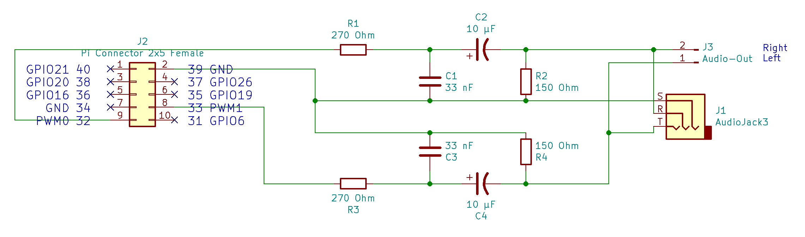
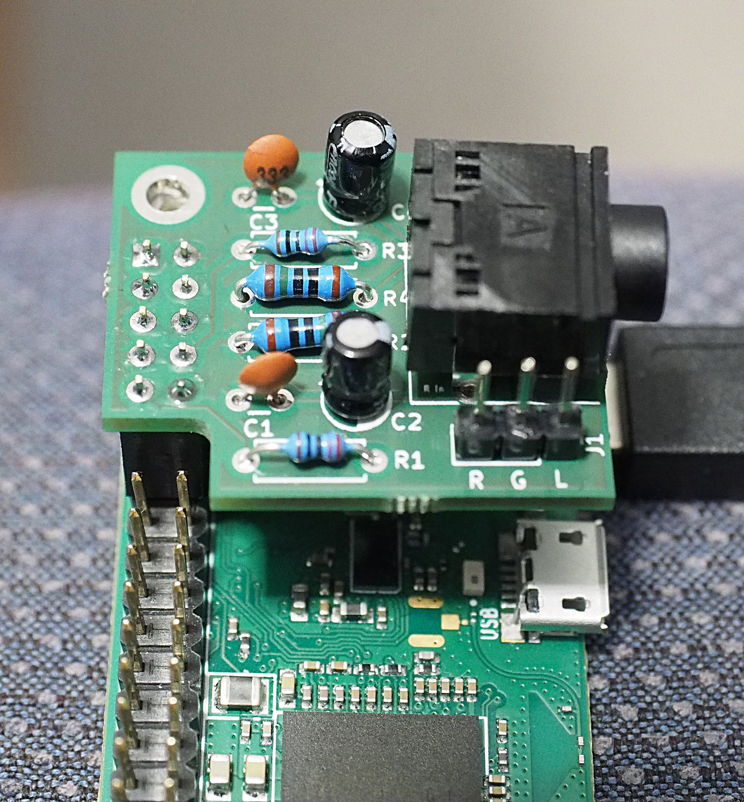
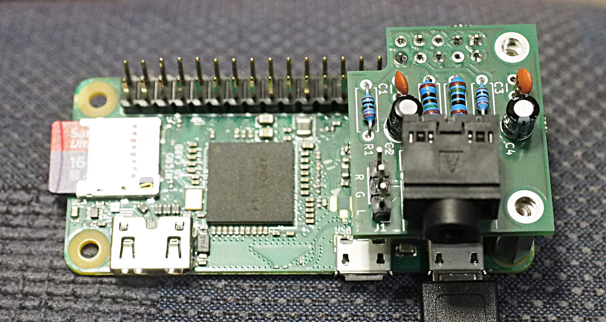

Pi-Zero-Analogaudio
===================

The Pi-Zero is a stripped down board, there is no analog audio jack
like on the bigger Pis. But it is no problem to add it using a few
simple and cheap components.

The schematic

shows the necessary parts and the wiring. Basically, you configure the
Zero to output pwm-signals, then you use a combination of a lowpass
and highpass filter to clean the signal on every channel.

The audio quality is ok, but not on hifi level. The filters limit the
frequency range and the signal is still not absolutely clean afterwards.
If you really need high-quality audio-output, use HDMI, bluetooth or
attach an audio-hat based on I2S using a DAC.

Hardware
========

Required parts:

  - two resistors 270 Ohm
  - two resistors 150 Ohm
  - two capacitors 33nF
  - two capacitors 10µF
  - an 3.5mm audio-jack (e.g. STX-3120-5B from Adafruit)
  - some jumper-wires

In the folder `kicad` you can find a complete pcb, designed for the above
throughhole components. You will need to adapt the design if you use a
different audio-jack.

Software and System Configuration
=================================

You don't need special software, just use `aplay` to play wav-files or
e.g. `mpg123` for mp3-files.

You can configure the system manually, or you can clone the repository
and just run the install command:

    git clone https://github.com/bablokb/pi-zero-analogaudio.git
    cd pi-zero-analogaudio
    sudo tools/install

The install command will add the following lines to your `/boot/config.txt`:

    dtparam=audio=on
    dtoverlay=pwm-2chan,pin=12,func=4,pin2=13,func2=4

This configures analog-audio for the physical pins 32 and 33. Other
pin-combinations are possible, see the file `/boot/overlays/README` for
a complete list.

In addition, the install command runs

    amixer cset numid=3 1

This switches the audio-output from auto (0) or HDMI (2) to analog-out (1).
You can also use `raspi-config` for this task (or for switching back).
